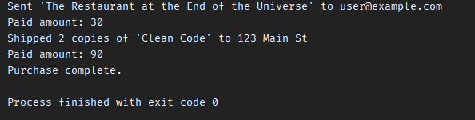
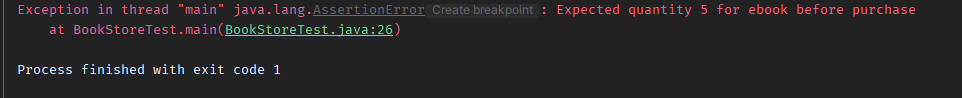
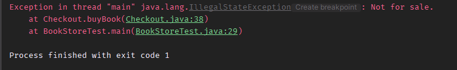

# Quantum Book Store

An online book store simulation written in Java. Supports multiple book types, purchase logic, and inventory management.

## Features

- Add books to inventory (EBook, PaperBook, ShowcaseBook)
- Buy books using ISBN and quantity
- Send EBooks via email (simulated)
- Ship PaperBooks to an address (simulated)
- Prevent sale of showcase/demo books
- Remove outdated books based on publish year

## Screenshots

### Main class

### Testing class

